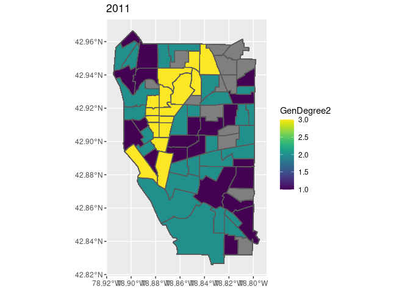
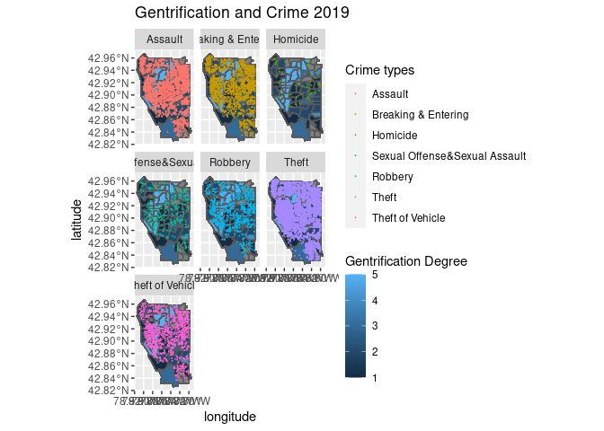
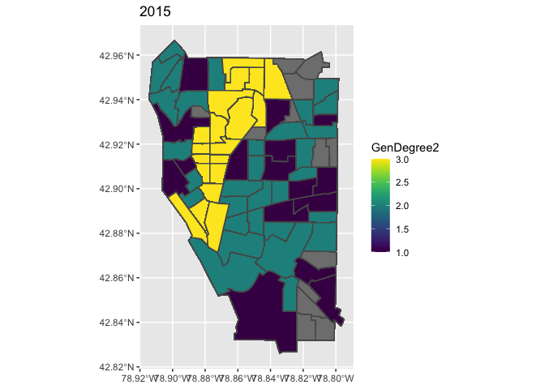
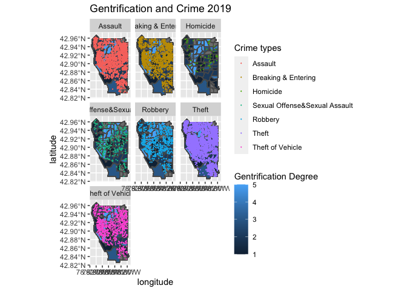

# Introduction

    The surgent growth of gentrification across cities since the 1970s has received increased attention from American society. Research demonstrates gentrification has significantly changed — for better or worse —neighborhood socioeconomic characteristics. Besides, this city redevelopment trend has nearly coincided with the U.S. crime changes in the late 20th century — the crime rates in major U.S. cities increased from the 1960s to the 1980s and then experienced a considerable drop during the 1990s (Barton 2016b). However, scholars have spent limited resources in studying the relationship between gentrification and crime. Considering the widespread gentrification phenomenon and the growing importance of crime occurrences in the U.S., it is essential to explore the association between these two compelling trends.
    Due to the inconsistent operationalizations and limited methodological approaches in the fields of gentrification and crime, the few studies on their relationship have drawn conflicting conclusions. Several scholars have concluded that there is a positive relationship between gentrification and crime due to the incomplete neighborhood transformation, the disruption of the established social order, or the aggregation of suitable and lucrative targets — the move-in middle-class residents, in gentrifying inner-city neighborhoods (Covington and Taylor 1989). Other studies have argued that gentrification is accompanied by decreasing neighborhood crime rates through establishing relatively stable areas with the influx of economically advantaged residents (Barton 2016; MacDonald and Stokes 2020; Papachristos et al. 2011). The incompatible findings can be attributed to the inconsistent measurement of gentrification, temporal variations, and different analytical approaches. Also, little research has assessed what is the underlying gentrification mechanisms affecting neighborhood crime. My research intends to fill the research gaps by examining the overall association between gentrification using a comprehensive gentrification measurement. I also examine the association between specific gentrification mechanisms and crime. Specifically, my study attempts to examine the impact of different degrees and aspects of gentrification on neighborhood crime changes at the census tract level in Buffalo, NY, by using a modified quantitative measurement and neighborhood typology.


# Data and Methods

    The current study examined the association of gentrification and seven (?) forms of violent crime in Buffalo, NY for the period 2011 to 2019 at census tract level. This objective was achieved by utilizing two steps. First, the quantitative operationalization of gentrification and the typology of gentrification degree were based on changes in sociodemographic and socioeconomic characteristics in Buffalo, NY (79 tracts) from 2011 to 2019 American Community Survey 1-year Estimate data. Second, correlation in gentrification and crime over this 9-year period was examined to determine whether the association in Buffalo (79 tracts) was varied over time, which was important given the dynamic nature of gentrification. The Ordinary Least Squares Regression (OLS), controlling between-unit variation, is applied here to examine the association between gentrification and crime.

Dependent Variables: Violent Index Crimes
  	For the crime data, I use the open dataset called Crime Incidents by Open Data Buffalo with public access on their official website (data.buffalony.gov), where data is provided by the Buffalo Police Department. This dataset is updated daily and provides the crime incidents in Buffalo at the census tract level from 2009 to 2021.
    The dependent variable is the total crime rate per 1,000 tract residents in Buffalo from 2011-2019. I also examined seven different violent crime and property crime, including assault, robbery, homicide, sexual assault, sexual offense, theft, and theft of vehicle. 

Operationalization of Gentrification
    To measure the stages of gentrification, I use a case study of Buffalo, New York with 79 census tracts. Specifically, I use the American Community Survey 1-year estimates from 2011 to 2019. To further evaluate the influence of various gentrification stages, I also conduct a gentrification stage analysis by creating three major gentrification indexes, including the presence of vulnerable populations, gentrification-related demographic changes, and housing condition changes. Moreover, I make use of a neighborhood typology for categorizing the specific stages.


```r
library(tidycensus)
library(sf)
library(tidyverse)
library(haven)
library(viridis)
library(leaflet)
library(tidyr)
library(kableExtra)


census_api_key(Sys.getenv("CENSUS_API_KEY"),install=TRUE, overwrite = TRUE)
```

```
## [1] "7e9b9dfdae5d56fbf2a5c8e243c74bccbe74af98"
```

```r
readRenviron("~/.Renviron")
```


```r
library(tidyverse)
library(leaflet)
library(kableExtra)
knitr::opts_chunk$set(cache=TRUE)  # cache the results for quick compiling
```

## Download and clean all the required data. Got the variables from tidycensus that are related to gentrification measurement.

```r
year=2012:2019
tract.list=NULL
county.list=NULL
tract_county_merge.list=NULL
for (i in 1:8){
  d1= get_acs(geography = "tract", state = "NY",
              county = "Erie", variables = c(TotalP_t="B01001_001",
                TotalRace_t= "B02001_001",
                                             White_t="B02001_002",
                                             nonHispanicWhite_t="B03002_003",
                                             nonHispanicWhiteTotal_t="B03002_001",
                                             Homeowner_t="B25003_002",
                                             renterHS_t="B25003_003",
                                             TenureHSTotal_t="B25003_001",
                                             collegedegree_t="B15003_022",
                                             degreeTotal_t="B15003_001",
                                             # HSIncome_t=c("B19001_001","B19001_002","B19001_003","B19001_004","B19001_005","B19001_006","B19001_007","B19001_008","B19001_009"),##how to do it in a quicker way??
                                             medianHSincome_t="B19013_001",
                                             medianHValue_t="B25077_001",
                                             medianGRent_t="B25064_001",
                                             Poverty_t="B17001_002",
                                             PovertyTotal_t="B17001_001",
                                             ForeignBorn_t="B05002_009",
                                             NavitityTotal_t="B05002_001",
                                             Profjobs_t="C24070_010",
                                             jobsTotal_t="C24070_001"
              ),year=year[i],geometry = TRUE,
              cache_table=T)
  # create a county column in tract dataset for the later merge with county data.
  d1$CountyGEOID=36029
  d1$Year=year[i]
  tract.list[i]=list(d1)
  
  d2 = get_acs(geography = "county", state = "NY",
               county = "Erie", variables = c(TotalP_c="B01001_001",
                 TotalRace_c= "B02001_001",
                                              White_c="B02001_002",
                                              nonHispanicWhite_c="B03002_003",
                                              nonHispanicWhiteTotal_c="B03002_001",
                                              Homeowner_c="B25003_002",
                                              renterHS_c="B25003_003",
                                              TenureHSTotal_c="B25003_001",
                                              collegedegree_c="B15003_022",
                                              degreeTotal_c="B15003_001",
                                              # HSIncome_c=c("B19001_001","B19001_002","B19001_003","B19001_004","B19001_005","B19001_006","B19001_007","B19001_008","B19001_009"),##how to do it in a quicker way??
                                              medianHSincome_c="B19013_001",
                                              medianHValue_c="B25077_001",
                                              medianGRent_c="B25064_001",
                                              Poverty_c="B17001_002",
                                              PovertyTotal_c="B17001_001",
                                              ForeignBorn_c="B05002_009",
                                              NavitityTotal_c="B05002_001",
                                              Profjobs_c="C24070_010",
                                              jobsTotal_c="C24070_001"
               ),year=year[i],geometry = FALSE,
               cache_table=T)
  
  county.list[i]=list(d2)
  
  ###make the tract data into wide format from the long format
  
  
  d1_noMOE=subset(d1,select=-moe)
  d1=spread(d1_noMOE, key = variable, value = estimate)
  
  
  ###make the county data into wide format from the long format
  d2_noMOE=subset(d2,select=-moe)
  d2=spread(d2_noMOE, key = variable, value = estimate)
  
  
  #then merge the county dataset with the tract dataset
  d_merge=merge(d1,d2,
                by.x = "CountyGEOID", by.y = "GEOID")
  # str(d_merge)
  
  tract_county_merge.list[i]=list(d_merge)
}
```

```r
##change it to dataframe
data2012=data.frame(tract_county_merge.list[1])
data2013=data.frame(tract_county_merge.list[2])
data2014=data.frame(tract_county_merge.list[3])
data2015=data.frame(tract_county_merge.list[4])
data2016=data.frame(tract_county_merge.list[5])
data2017=data.frame(tract_county_merge.list[6])
data2018=data.frame(tract_county_merge.list[7])
data2019=data.frame(tract_county_merge.list[8])
```


```r
#####Modified the 2011&2010 data since they don't have variables about education for total population. I manually imported them from social explorer (https://www.socialexplorer.com/reports-beta/report/a5c293b8-2709-11ec-aafd-132ea339dce2).
###2011
tract_2011 = get_acs(geography = "tract", state = "NY", 
                     county = "Erie", variables = c(TotalP_t="B01001_001",
                       TotalRace_t= "B02001_001",
                                                    White_t="B02001_002",
                                                    nonHispanicWhite_t="B03002_003",
                                                    nonHispanicWhiteTotal_t="B03002_001",
                                                    Homeowner_t="B25003_002",
                                                    renterHS_t="B25003_003",
                                                    TenureHSTotal_t="B25003_001",
                                                    ##collegedegree_t="B15003_022",
                                                    ##degreeTotal_t="B15003_001", no B15003 variable in acs 2011 dataset
                                                    medianHSincome_t="B19013_001",
                                                    medianHValue_t="B25077_001",
                                                    medianGRent_t="B25064_001",
                                                    Poverty_t="B17001_002",
                                                    PovertyTotal_t="B17001_001",
                                                    ForeignBorn_t="B05002_009",
                                                    NavitityTotal_t="B05002_001",
                                                    Profjobs_t="C24070_010",
                                                    jobsTotal_t="C24070_001"
                     ),year=2011,geometry = TRUE, 
                     cache_table=T)


county_2011 = get_acs(geography = "county", state = "NY", 
                      county = "Erie", variables = c(TotalP_c="B01001_001",
                        TotalRace_c= "B02001_001",
                                                     White_c="B02001_002",
                                                     nonHispanicWhite_c="B03002_003",
                                                     nonHispanicWhiteTotal_c="B03002_001",
                                                     Homeowner_c="B25003_002",
                                                     renterHS_c="B25003_003",
                                                     TenureHSTotal_c="B25003_001",
                                                     ##collegedegree_c="B15003_022",
                                                     ##degreeTotal_c="B15003_001",
                                                     medianHSincome_c="B19013_001",
                                                     medianHValue_c="B25077_001",
                                                     medianGRent_c="B25064_001",
                                                     Poverty_c="B17001_002",
                                                     PovertyTotal_c="B17001_001",
                                                     ForeignBorn_c="B05002_009",
                                                     NavitityTotal_c="B05002_001",
                                                     Profjobs_c="C24070_010",
                                                     jobsTotal_c="C24070_001"
                      ),year=2011,geometry = FALSE, 
                      cache_table=T)

###make the tract data into wide format from the long format
tract_2011_noMOE=subset(tract_2011,select=-moe)
tract_2011=spread(tract_2011_noMOE, key = variable, value = estimate)

###make the county data into wide format from the long format
county_2011_noMOE=subset(county_2011,select=-moe)
county_2011=spread(county_2011_noMOE, key = variable, value = estimate)
```


```r
#######add Bachelor's degree manually (both for the county and tract level) from the census 2011 acs 5 year estimate survey 
#######since there isn't any variable for the bachelor's degree for total population over 25 years old

##for tract new variables
tract_2011_web=read.csv("Data/R12919572_SL140.csv")
tract_2011_manual=tract_2011_web %>%
  subset(.data = tract_2011_web,select=c(Geo_NAME,SE_A12001_001,SE_A12001_005))
##for county new variables
county_2011_web=read.csv(file="Data/R12919572_SL050.csv")
county_2011_manual=county_2011_web %>%
  subset(.data = county_2011_web,select=c(Geo_NAME,SE_A12001_001,SE_A12001_005))

##rename the column, get rid of the variable id
tract_2011_manual=rename(tract_2011_manual, degreeTotal_t=SE_A12001_001,collegedegree_t=SE_A12001_005)
county_2011_manual=rename(county_2011_manual, degreeTotal_c=SE_A12001_001,collegedegree_c=SE_A12001_005)

###join the web tract and county education info with the original 2011 acs data
tract_2011_join=left_join(tract_2011,tract_2011_manual,by=c("NAME"="Geo_NAME"))
county_2011_join=left_join(county_2011,county_2011_manual,by=c("NAME"="Geo_NAME"))
```


```r
##merge the 2011 tract data with the 2011 county data
#first create a county column in tract dataset.
tract_2011_join$CountyGEOID=36029
tract_2011_join$Year=2011
#then merge the county dataset with the tract dataset
data2011=merge(tract_2011_join,county_2011_join,
               by.x = "CountyGEOID", by.y = "GEOID")
# str(data2011)
#the difference between data2011 and tract_county_2011 is the previous one's variables' name don't have year included (in order to append different years' data together in a long format)
```


```r
### Modified the 2010 data.
tract_2010 = get_acs(geography = "tract", state = "NY", 
                     county = "Erie", variables = c(TotalP_t="B01001_001",
                       TotalRace_t= "B02001_001",
                                                    White_t="B02001_002",
                                                    nonHispanicWhite_t="B03002_003",
                                                    nonHispanicWhiteTotal_t="B03002_001",
                                                    Homeowner_t="B25003_002",
                                                    renterHS_t="B25003_003",
                                                    TenureHSTotal_t="B25003_001",
                                                    ###collegedegree_t="B15003_022",
                                                    ###degreeTotal_t="B15003_001",
                                                    # HSIncome_t=c("B19001_001","B19001_002","B19001_003","B19001_004","B19001_005","B19001_006","B19001_007","B19001_008","B19001_009"),##how to do it in a quicker way??
                                                    medianHSincome_t="B19013_001",
                                                    medianHValue_t="B25077_001",
                                                    medianGRent_t="B25064_001",
                                                    Poverty_t="B17001_002",
                                                    PovertyTotal_t="B17001_001",
                                                    ForeignBorn_t="B05002_009",
                                                    NavitityTotal_t="B05002_001",
                                                    Profjobs_t="C24070_010",
                                                    jobsTotal_t="C24070_001"
                     ),year=2010,geometry = TRUE, 
                     cache_table=T)

county_2010 = get_acs(geography = "county", state = "NY", 
                      county = "Erie", variables = c(TotalP_c="B01001_001",
                        TotalRace_c= "B02001_001",
                                                     White_c="B02001_002",
                                                     nonHispanicWhite_c="B03002_003",
                                                     nonHispanicWhiteTotal_c="B03002_001",
                                                     Homeowner_c="B25003_002",
                                                     renterHS_c="B25003_003",
                                                     TenureHSTotal_c="B25003_001",
                                                     ###collegedegree_c="B15003_022",
                                                     ###degreeTotal_c="B15003_001",
                                                     medianHSincome_c="B19013_001",
                                                     medianHValue_c="B25077_001",
                                                     medianGRent_c="B25064_001",
                                                     Poverty_c="B17001_002",
                                                     PovertyTotal_c="B17001_001",
                                                     ForeignBorn_c="B05002_009",
                                                     NavitityTotal_c="B05002_001",
                                                     Profjobs_c="C24070_010",
                                                     jobsTotal_c="C24070_001"
                      ),year=2010,geometry = FALSE, 
                      cache_table=T)
```


```r
###make the tract data into wide format from the long format
tract_2010_noMOE=subset(tract_2010,select=-moe)
tract_2010=spread(tract_2010_noMOE, key = variable, value = estimate)

###make the county data into wide format from the long format
county_2010_noMOE=subset(county_2010,select=-moe)
county_2010=spread(county_2010_noMOE, key = variable, value = estimate)
```


```r
#######add Bachelor's degree manually (both for the county and tract level) from the census 2010 acs 5 year estimate survey 
#######since there isn't any variable for the bachelor's degree for total population over 25 years old

##for tract new variables
tract_2010_web=read.csv(file="Data/2010_tract_webinfo.csv")
tract_2010_manual=tract_2010_web %>%
  subset(.data = tract_2010_web,select=c(Geo_NAME,SE_A12001_001,SE_A12001_005))
##for county new variables
county_2010_web=read.csv(file="Data/2010_county_webinfo.csv")
county_2010_manual=county_2010_web %>%
  subset(.data = county_2010_web,select=c(Geo_NAME,SE_A12001_001,SE_A12001_005))

##rename the column, get rid of the variable id
tract_2010_manual=rename(tract_2010_manual, degreeTotal_t=SE_A12001_001,collegedegree_t=SE_A12001_005)
county_2010_manual=rename(county_2010_manual, degreeTotal_c=SE_A12001_001,collegedegree_c=SE_A12001_005)
```


```r
###join the web tract and county education info with the original 2010 acs data
tract_2010_join=left_join(tract_2010,tract_2010_manual,by=c("NAME"="Geo_NAME"))
county_2010_join=left_join(county_2010,county_2010_manual,by=c("NAME"="Geo_NAME"))

##merge the 2010 tract data with the 2010 county data
#first create a county column in tract dataset.
tract_2010_join$CountyGEOID=36029
tract_2010_join$Year=2010
# view(tract_2010_join)
#then merge the county dataset with the tract dataset
data2010=merge(tract_2010_join,county_2010_join,
               by.x = "CountyGEOID", by.y = "GEOID")
```


```r
# append all year datasets together
allyears=rbind(data2019,data2018,data2017,data2016,data2015, data2014, data2013, data2012, data2011, data2010)
```


```r
######################calculate the column percentages for county and tract levels
allyears= transform(allyears,
                    pctNonWhite_t=(TotalRace_t-White_t)/TotalRace_t*100,
                    pctNonWhite_c=(TotalRace_c-White_c)/TotalRace_c*100,
                    pctnonHisWhite_t=nonHispanicWhite_t/nonHispanicWhiteTotal_t*100,
                    pctnonHisWhite_c=nonHispanicWhite_c/nonHispanicWhiteTotal_c*100,
                    ###lowmedHSInc_tract is household income below 80% of the county median
                    # low_medHSInc_c=0.8*medianHSincome_c,
                    pctForeign_born_t=ForeignBorn_t/NavitityTotal_t*100,
                    pctForeign_born_c=ForeignBorn_c/NavitityTotal_c*100,
                    pctBachelor_t=collegedegree_t/degreeTotal_t*100,
                    pctBachelor_c=collegedegree_c/degreeTotal_c*100,
                    pctHowners_t=Homeowner_t/TenureHSTotal_t*100,
                    pctHowners_c=Homeowner_c/TenureHSTotal_c*100,
                    pctRenters_t=renterHS_t/TenureHSTotal_t*100,
                    pctRenters_c=renterHS_c/TenureHSTotal_c*100,
                    pctProfjobs_t=Profjobs_t/jobsTotal_t*100,
                    pctProfjobs_c=Profjobs_c/jobsTotal_c*100,
                    pctPoverty_t=Poverty_t/PovertyTotal_t*100,
                    pctPoverty_c=Poverty_c/PovertyTotal_c*100)
```


```r
####compare the tract level data with the county level data for dynamic gentrification measurement, if true, then 1; if false, then 0.
allyears=allyears %>% 
  mutate("pctRenters_abovecounty" = ifelse(pctRenters_t>pctRenters_c,1,0),
         "pctNonWhite_abovecounty"=ifelse(pctNonWhite_t>pctNonWhite_c,1,0),
         "pctBach_belowcounty"=ifelse(pctBachelor_t<pctBachelor_c,1,0),
         "pctForeignBorn_abovecounty"=ifelse(pctForeign_born_t>pctForeign_born_c,1,0),
         "pctPoverty_abovecounty"=ifelse(pctPoverty_t>pctPoverty_c,1,0)) ###not using low income household anymore.
# construct the first gentrification index: Vulnerable by adding the column from 59 to column 63, which are the above five indicators.
allyears$Vuldegree <- rowSums(allyears[ , c(61:65)], na.rm=FALSE)
allyears$Vul=ifelse(allyears$Vuldegree>=3,1,0)
```


```r
####getting cross-time differences for counties and tracts
year=rev(2010:2019)
new.d.list=NULL
length(year)
for (i in 1:9){
  a=year[i];b=year[i]-1
  d1<-subset(allyears, Year==year[i]) %>% 
    select(GEOID,pctHowners_t,pctHowners_c,pctNonWhite_t,pctNonWhite_c,pctBachelor_t,pctBachelor_c,medianHSincome_t,medianHSincome_c,pctForeign_born_t,pctForeign_born_c,pctProfjobs_t,pctProfjobs_c,
           medianHValue_t,medianHValue_c,medianGRent_t,medianGRent_c)
  d2=subset(allyears, Year==year[i]-1) %>% 
    select(GEOID,pctHowners_t,pctHowners_c,pctNonWhite_t,pctNonWhite_c,pctBachelor_t,pctBachelor_c,medianHSincome_t,medianHSincome_c,pctForeign_born_t,pctForeign_born_c,pctProfjobs_t,pctProfjobs_c,
           medianHValue_t,medianHValue_c,medianGRent_t,medianGRent_c)
  d3=cbind(GEOID=d1[ ,1],d1[,-c(1)]-d2[,-c(1)]) ###subtract two datasets except the "GEOID" column
  
  colnames(d3)<-   ###need to rename the variables as td
    paste(colnames(d3),"td",sep = "_")
  
  new.d.list[i]=list(d3)
}
change2019=data.frame(new.d.list[1])
change2019$Year=2019

change2018=data.frame(new.d.list[2])
change2018$Year=2018

change2017=data.frame(new.d.list[3])
change2017$Year=2017

change2016=data.frame(new.d.list[4])
change2016$Year=2016

change2015=data.frame(new.d.list[5])
change2015$Year=2015

change2014=data.frame(new.d.list[6])
change2014$Year=2014

change2013=data.frame(new.d.list[7])
change2013$Year=2013

change2012=data.frame(new.d.list[8])
change2012$Year=2012

change2011=data.frame(new.d.list[9])
change2011$Year=2011

#append all years'changes data together
allchanges=rbind(change2019,change2018,change2017,change2016,change2015, change2014, change2013, change2012, change2011)

##merge data
allchanges_merge=left_join(x=allyears,y=allchanges,
                           by=c("GEOID"= "GEOID_td","Year"="Year"))
##drop the 2010 data since it doesn't have changes compared with the previous years (no 2009 data) by using subset
#remove(allyearchanges_merge)
yearswchanges=subset(allchanges_merge,Year!=2010)
```


```r
###Compare the time difference at tract level with the county level
##2. Second index of gentrification: Demographic changes between the year and the previous year
yearswchanges=yearswchanges %>% 
  mutate("pctchan_Howners_abovecounty" = ifelse(pctHowners_t_td>pctHowners_c_td,1,0),
         "pctchan_nonHisWhite_abcounty"=ifelse(pctNonWhite_t_td>pctNonWhite_c_td,1,0),
         "pctchan_Bach_abcounty"=ifelse(pctBachelor_t_td<pctBachelor_c_td,1,0),
         "change_medHSInc_abcounty"=ifelse(medianHSincome_t_td>medianHSincome_c_td,1,0),
         "pctchange_ForeignB_abcounty"=ifelse(pctForeign_born_t_td>pctForeign_born_c_td,1,0),
         "pctchange_Prof_abovecounty"=ifelse(pctProfjobs_t_td>pctProfjobs_c_td,1,0))

##construct the second gentrification index: Dem changes
yearswchanges$Demdegree <- rowSums(yearswchanges[ , c(84:89)], na.rm=FALSE)
yearswchanges$WhiteandBachIncrease=rowSums(yearswchanges[,c(85,86)], na.rm=FALSE)
yearswchanges=yearswchanges %>% 
  # mutate(Dem=ifelse(Demdegree>=4|WhiteandBachIncrease==2,1,0))
  mutate(Dem=ifelse(Demdegree>=4|WhiteandBachIncrease==2,1,0))

##3. Housing Market condition
yearswchanges=yearswchanges %>% 
  mutate("change_medHSValue_abcounty"=ifelse(medianHValue_t_td>medianHValue_c_td,1,0),
         "change_medGrossRent_abcounty"=ifelse(medianGRent_t_td>medianGRent_c_td,1,0))
##construct the third gentrification index: Housing Market Condition Changes
yearswchanges$HousingMarketDegree=rowSums(yearswchanges[ , c(93:94)], na.rm=FALSE)
yearswchanges=yearswchanges %>% 
  mutate("HousingMarket"=ifelse(HousingMarketDegree==2,1,0))
```

```r
################import the crime data from STATA
crime_initial=read_dta(file = "Data/BuffaloCrime_tract_since2011.dta") %>% 
  select(address,zip,latitude,longitude,day_of_week,parent_incident_type,neighborhood,censustract2010,crimedate,crimetime)

####getting crime data ready, for having GEOID and have the Year column for merge
##1.set the tract number as numeric to become the same version of GEOID
crime_initial$censustract2010=
  as.numeric(crime_initial$censustract2010,na.rm = TRUE)
class(crime_initial$censustract2010)

crime1 =
  transform(crime_initial,
            GEOID=censustract2010*100+36029000000,na.rm = FALSE
  )
###2. get the Year column
class(crime1$crimedate)
crime1$Year <- as.numeric(format(crime1$crimedate,'%Y'))

####only select the tract number for merge with the main dataset
crime_formerge=crime1 %>% 
  select(day_of_week,parent_incident_type,GEOID,censustract2010,Year,latitude,longitude)
crime_formerge$GEOID=as.character(crime_formerge$GEOID)

####merge the main dataset with the crime dataset
gentri_crime_tract=left_join(yearswchanges,crime_formerge,c("GEOID","Year"))

v1=
  c("GEOID","Year","Vul","Dem","Demdegree","WhiteandBachIncrease","HousingMarket","medianGRent_c","medianGRent_t","medianHValue_c","medianHValue_t","geometry")

###Construct the gentrification stages.
genD=yearswchanges[,v1]
genD=genD %>% 
  mutate("Susceptible"=ifelse(is.na(Vul)|is.na(Dem)|is.na(HousingMarket),NA,0),
         "Susceptible"=ifelse(genD$Vul==1&genD$Dem==0&genD$HousingMarket==0&(medianGRent_t<medianGRent_c)&(genD$medianHValue_t<genD$medianHValue_c),1,Susceptible),
         "Early_Prop"=ifelse(is.na(Vul)|is.na(Dem)|is.na(HousingMarket),NA,0),
         "Early_Prop"=ifelse(genD$Vul==1 &genD$Dem==0&genD$HousingMarket==1&(medianGRent_t<medianGRent_c)&(genD$medianHValue_t<genD$medianHValue_c),1,Early_Prop),
         "Early_Demo"=ifelse(is.na(Vul)|is.na(Dem)|is.na(HousingMarket),NA,0),
         "Early_Demo"=ifelse(genD$Vul==1 &genD$Dem==1&genD$HousingMarket==0&genD$medianGRent_t<genD$medianGRent_c,1,Early_Demo),
         "Early_Demo"=ifelse(genD$Vul==1 &genD$Dem==1&genD$HousingMarket==0&genD$medianHValue_t<genD$medianHValue_c,1,Early_Demo),
         "Middle"=ifelse(is.na(Vul)|is.na(Dem)|is.na(HousingMarket),NA,0),
         "Middle"=ifelse(genD$Vul==1 &genD$Dem==1&genD$HousingMarket==1&(medianGRent_t<medianGRent_c)&(genD$medianHValue_t<genD$medianHValue_c),1,Middle),
         "Late"=ifelse(is.na(Vul)|is.na(Dem)|is.na(HousingMarket),NA,0),
         "Late"=ifelse(genD$Vul==1 &genD$Dem==1&genD$HousingMarket==0&(medianGRent_t>medianGRent_c)|(genD$medianHValue_t>genD$medianHValue_c) ,1,Late),
          Gentrified=ifelse(is.na(Vul)|is.na(Dem)|is.na(HousingMarket),NA,0),
         Gentrified=ifelse(genD$Vul==0 &genD$Demdegree>=3&HousingMarket==0&(genD$medianGRent_t>genD$medianGRent_c)|(genD$medianHValue_t>genD$medianHValue_c),1,Gentrified),
         Gentrified=ifelse(genD$Vul==0 &genD$WhiteandBachIncrease==1&HousingMarket==0&(genD$medianGRent_t>genD$medianGRent_c)|(genD$medianHValue_t>genD$medianHValue_c),1,Gentrified))
         

genD= genD%>%
  ###for despcriptive, distinguish between gentrification middle stage property change with demographic change
  mutate("GenDegree1"=NA) %>%
  mutate(
    # "GenDegree1"=ifelse(NoGen==1,0,GenDegree1),
    "GenDegree1"=ifelse(Susceptible==1,1,GenDegree1),
    "GenDegree1"=ifelse(Early_Prop==1,2,GenDegree1),
    "GenDegree1"=ifelse(Early_Demo==1,3,GenDegree1),
    "GenDegree1"=ifelse(Middle==1,4,GenDegree1),
    "GenDegree1"=ifelse(Late==1,5,GenDegree1),
    "GenDegree1"=ifelse(Gentrified==1,6,GenDegree1)) %>% 
  mutate("GenDegree"=NA) %>%
  mutate(
         "GenDegree"=ifelse(Susceptible==1,1,GenDegree),
         "GenDegree"=ifelse(Early_Prop==1,2,GenDegree),
         "GenDegree"=ifelse(Early_Demo==1,2,GenDegree),
         "GenDegree"=ifelse(Middle==1,3,GenDegree),
         "GenDegree"=ifelse(Late==1,4,GenDegree),
         "GenDegree"=ifelse(Gentrified==1,5,GenDegree)) %>% 
  mutate("GenDegree2"=NA) %>%
  mutate(
    # "GenDegree"=ifelse(NoGen==1,0,GenDegree),
    "GenDegree2"=ifelse(Susceptible==1,1,GenDegree2),
    "GenDegree2"=ifelse(Early_Prop==1,2,GenDegree2),
    "GenDegree2"=ifelse(Early_Demo==1,2,GenDegree2),
    "GenDegree2"=ifelse(Middle==1,2,GenDegree2),
    "GenDegree2"=ifelse(Late==1,2,GenDegree2),
    # "GenDegree2"=ifelse(ongoingGen==1,3,GenDegree2),
    "GenDegree2"=ifelse(Gentrified==1,3,GenDegree2))

df=genD %>% 
  filter(Year==c(2011,2015,2019)) %>% 
  group_by(Year,GenDegree2) %>% 
  summarise(count=n())

genD_formerge = genD%>%
  select(GEOID,Year,GenDegree,GenDegree1,GenDegree2,geometry) %>% 
  st_as_sf()

gentri_crime_tract_1=inner_join(gentri_crime_tract,genD_formerge,c("GEOID","Year","geometry"))

  ##only include the tracts have crime data (Buffalo), drop NA
gentri_crime_tract_1=gentri_crime_tract_1[complete.cases(gentri_crime_tract_1[,"parent_incident_type"]),]
  
##collapse the sexual offense, sexual assault, and other sexual offense into a same category: sexual offense& sexual assault
gentri_crime_tract_1$parent_incident_type=as.factor(gentri_crime_tract_1$parent_incident_type)

gentri_crime_tract_1$parent_incident_type=recode(gentri_crime_tract_1$parent_incident_type,"Sexual Assault"="Sexual Offense&Sexual Assault","Sexual Offense"="Sexual Offense&Sexual Assault","Other Sexual Offense"="Sexual Offense&Sexual Assault")
```


# Results


```r
#get the crime rate for each type
gentri_crime_quick=gentri_crime_tract_1 %>% 
  select(GEOID,TotalP_t,Vul,Dem,HousingMarket,Vuldegree,Demdegree,HousingMarketDegree,GenDegree,Year,day_of_week,parent_incident_type,geometry,NAME.x,geometry)
# 
#crime rate per 1,000 residents in buffalo area
Crimeoverall=gentri_crime_quick %>% 
  group_by(Year) %>% 
  summarise(mean_tract_count=mean(n()/79),#dividing by the total 79 buffalo tract 
             TotalP_t=mean(TotalP_t),
            CrimeRate=mean(mean_tract_count/TotalP_t*1000), ## crime rate every 1000 persons for the whole buffalo area 
            # Crime_type=(parent_incident_type),
            # see=mean(sum(parent_incident_type=="Assault",na.rm = FALSE)/79),
            Assault=mean(mean(sum(parent_incident_type=="Assault",na.rm = FALSE)/79)/TotalP_t*1000),#Assault rate
            Break_and_Enter=mean(mean(sum(parent_incident_type=="Breaking & Entering")/79)/TotalP_t*1000),
            Homicide=mean(mean(sum(parent_incident_type=="Homicide")/79)/TotalP_t*1000),
            Robbery=mean(mean(sum(parent_incident_type=="Robbery")/79)/TotalP_t*1000),
            SexualOffenseAndSexualAssault=mean(mean(sum(parent_incident_type=="Sexual Offense&Sexual Assault")/79)/TotalP_t*1000),
            Theft=mean(mean(sum(parent_incident_type=="Theft")/79)/TotalP_t*1000),
            TheftVehicle=mean(mean(sum(parent_incident_type=="Theft of Vehicle")/79)/TotalP_t*1000)
            ) %>% 
   select(-c(mean_tract_count,TotalP_t))
Crimeoverall$Year=as.factor(Crimeoverall$Year)
```

The Crime Trend in Buffalo from 2011-2019

```r
df1=gather(Crimeoverall,key = crimetypes, value=crimerates,-Year) %>% 
  mutate(crimetypes=recode(crimetypes,"CrimeRate"="OverallCrimeRate")) #change the variable text
ggplot(df1,aes(x=Year,y=crimerates,group=crimetypes,color=crimetypes))+
  geom_point()+
  geom_line()+
  theme(axis.text.x = element_text(size = 6),
    legend.title = element_text(size = 6), 
    legend.box.margin=margin(-10,-10,-10,-10),
        legend.text = element_text(size = 6),
    legend.position = "right")
```

<!-- -->
Overall decline with some fluctuations between 2011 and 2019. (Except Break and Enter, Homicide, and Sexual Offense and Sexual Assault).


```r
# #Then I run a regression for each nested tibble using purrr::map:
forcorr=gentri_crime_quick %>%
  group_by(GEOID,Year,parent_incident_type,GenDegree,Vul,Dem,HousingMarket,Vuldegree,Demdegree,HousingMarketDegree) %>%
  summarise(count=n(),
            rate=mean(count/TotalP_t*1000)
  )
forcorr$Year=as.factor(forcorr$Year)
forcorr$rate.log=log(forcorr$rate) #logged the crime rate

library(broom)
a=lm(data=forcorr,rate.log~GenDegree+Year) %>% 
  tidy() %>% #make it as a tidy table
  filter(term=="GenDegree") %>% 
  kable(caption ="Between Tract: Overall Crime") %>% 
  kable_styling() %>%
  save_kable(file ="Output/lmslope_betweendifference_overallcrime.png")
```


```r
####mapping
mapdf=gentri_crime_tract_1 %>% 
  mutate("parent_incident_type"=  as.character(parent_incident_type))
mapdf=gentri_crime_tract_1 %>% 
  filter(Year==2019)  %>% 
  
  group_by(GEOID,NAME.x,Year,GenDegree2,GenDegree1,GenDegree,latitude,longitude,parent_incident_type) %>% 
  summarise(geometry=geometry,
            count=n(),
            Assault=sum(parent_incident_type=="Assault",na.rm = FALSE),
            Break_and_Enter=sum(parent_incident_type=="Breaking & Entering"),
            Homicide=sum(parent_incident_type=="Homicide"),
            Robbery=sum(parent_incident_type=="Robbery"),
            SexualAssault=sum(parent_incident_type=="Sexual Assault"),
            SexualOffense=sum(parent_incident_type=="Sexual Offense"),
            OtherSexualOff=sum(parent_incident_type=="Other Sexual Offense"),
            Theft=sum(parent_incident_type=="Theft"),
            TheftVehicle=sum(parent_incident_type=="Theft of Vehicle")
            
  ) %>% 
  st_as_sf()

# mapdf %>% 
#   group_by(GEOID) %>% 
#   summarise(count=n())


map2015_1=gentri_crime_tract_1 %>% 
  mutate("parent_incident_type"=  as.character(parent_incident_type)) %>% 
  filter(Year==2015) %>% 
  select(GEOID,Year,GenDegree,GenDegree1,GenDegree2,geometry) %>% 
  st_as_sf()
# group_by(GEOID) %>% 
#   summarise(count=n())

# class(map2015_1)
map2011_1=gentri_crime_tract_1 %>% 
  filter(Year==2011) %>% 
  st_as_sf()

library(ggplot2)
ggplot(data = map2011_1, aes(fill=GenDegree2)) + geom_sf()+
  scale_fill_viridis(option = "viridis") +
  scale_color_viridis(option = "viridis")+
  labs(title =map2011_1$Year)
```

<!-- -->

```r
 # geom_label(aes(label=substr(GEOID,6,11),x,y))

ggplot(data = map2015_1, aes(fill=GenDegree2)) + geom_sf()+
  
  scale_fill_viridis(option = "viridis") +
  scale_color_viridis(option = "viridis")+
  labs(title =map2015_1$Year)
```

<!-- -->

```r
ggplot(data = mapdf, aes(fill=GenDegree2)) + geom_sf()+
  
  scale_fill_viridis(option = "viridis") +
  scale_color_viridis(option = "viridis")+
  labs(title =mapdf$Year)
```

<!-- -->


```r
Gen_crimemap2019=ggplot()+
  geom_sf(data=select(mapdf,-parent_incident_type), aes(fill=GenDegree))+
  geom_point(data=mapdf,aes(y=latitude,x=longitude,color=parent_incident_type),size=0.00001)+
  # scale_fill_discrete(options = "viridis") +
  # scale_color_discrete(option = "viridis")+
  facet_wrap(~parent_incident_type)+
  labs(title ="Gentrification and Crime 2019",fill="Gentrification Degree",color="Crime types")

ggsave("Gentirifcation&CrimeMap2019.png",width = 8.1,height = 8)
Gen_crimemap2019
```

<!-- -->


```r
###regress the specific mechanisms between tracts
#Vul
lmnested_Vul=forcorr %>%
  nest(data=-c(parent_incident_type))
lmnested_Vul %>%
  mutate(lmmodel = map(data, ~ lm(data=.,.x$rate.log~.x$Vuldegree+.x$Year)))
```

```
## # A tibble: 7 × 3
## # Groups:   parent_incident_type [7]
##   parent_incident_type          data                    lmmodel
##   <fct>                         <list>                  <list> 
## 1 Assault                       <grouped_df [708 × 12]> <lm>   
## 2 Breaking & Entering           <grouped_df [700 × 12]> <lm>   
## 3 Sexual Offense&Sexual Assault <grouped_df [641 × 12]> <lm>   
## 4 Robbery                       <grouped_df [690 × 12]> <lm>   
## 5 Theft                         <grouped_df [711 × 12]> <lm>   
## 6 Theft of Vehicle              <grouped_df [695 × 12]> <lm>   
## 7 Homicide                      <grouped_df [297 × 12]> <lm>
```

```r
# This results in a list-column of S3 objects. We want to tidy each of the objects, which we can also do with map.
library(broom)
lm_Vul=lmnested_Vul %>%
  mutate(
    lmReg_Vul = map(data, ~ lm(data=.,rate.log~Vuldegree+Year)), # S3 list-col
    tidied = map(lmReg_Vul, tidy)
  ) %>%
  unnest(tidied)

##select only the slope
lmslope_Vul=lm_Vul %>% 
  filter(term=="Vuldegree") %>% 
  rename(c(slope=estimate,crime_type=parent_incident_type)) %>% 
  filter(p.value<.05) %>%
  select(-c(data,lmReg_Vul))
# mutate(=estimate)

kable(lmslope_Vul) %>%
  kable_styling() %>%
  save_kable(file = "Output/lmslope_Vuldegree.png")


#Dem
lmnested_Dem=forcorr %>%
  nest(data=-c(parent_incident_type))
lmnested_Dem %>%
  mutate(lmmodel = map(data, ~ lm(data=.,.x$rate.log~.x$Demdegree+.x$Year)))
```

```
## # A tibble: 7 × 3
## # Groups:   parent_incident_type [7]
##   parent_incident_type          data                    lmmodel
##   <fct>                         <list>                  <list> 
## 1 Assault                       <grouped_df [708 × 12]> <lm>   
## 2 Breaking & Entering           <grouped_df [700 × 12]> <lm>   
## 3 Sexual Offense&Sexual Assault <grouped_df [641 × 12]> <lm>   
## 4 Robbery                       <grouped_df [690 × 12]> <lm>   
## 5 Theft                         <grouped_df [711 × 12]> <lm>   
## 6 Theft of Vehicle              <grouped_df [695 × 12]> <lm>   
## 7 Homicide                      <grouped_df [297 × 12]> <lm>
```

```r
# This results in a list-column of S3 objects. We want to tidy each of the objects, which we can also do with map.
library(broom)
lm_Dem=lmnested_Dem %>%
  mutate(
    lmReg_Dem = map(data, ~ lm(data=.,rate.log~Demdegree+Year)), # S3 list-col
    tidied = map(lmReg_Dem, tidy)
  ) %>%
  unnest(tidied)

##select only the slope
lmslope_Dem=lm_Dem %>% 
  filter(term=="Demdegree") %>% 
  rename(c(slope=estimate,crime_type=parent_incident_type)) %>% 
  filter(p.value<.05) %>%
  select(-c(data,lmReg_Dem))
# mutate(=estimate)

kable(lmslope_Dem) %>%
  kable_styling() %>%
  save_kable(file = "Output/lmslope_Demdegree.png")

#HousingMarket
lmnested_HousingMarket=forcorr %>%
  nest(data=-c(parent_incident_type))
lmnested_HousingMarket %>%
  mutate(lmmodel = map(data, ~ lm(data=.,.x$rate.log~.x$HousingMarketDegree+.x$Year)))
```

```
## # A tibble: 7 × 3
## # Groups:   parent_incident_type [7]
##   parent_incident_type          data                    lmmodel
##   <fct>                         <list>                  <list> 
## 1 Assault                       <grouped_df [708 × 12]> <lm>   
## 2 Breaking & Entering           <grouped_df [700 × 12]> <lm>   
## 3 Sexual Offense&Sexual Assault <grouped_df [641 × 12]> <lm>   
## 4 Robbery                       <grouped_df [690 × 12]> <lm>   
## 5 Theft                         <grouped_df [711 × 12]> <lm>   
## 6 Theft of Vehicle              <grouped_df [695 × 12]> <lm>   
## 7 Homicide                      <grouped_df [297 × 12]> <lm>
```

```r
# This results in a list-column of S3 objects. We want to tidy each of the objects, which we can also do with map.
library(broom)
lm_HousingMarket=lmnested_HousingMarket %>%
  mutate(
    lmReg_HousingMarket = map(data, ~ lm(data=.,rate.log~HousingMarketDegree+Year)), # S3 list-col
    tidied = map(lmReg_HousingMarket, tidy)
  ) %>%
  unnest(tidied)

##select only the slope
lmslope_HousingMarket=lm_HousingMarket %>% 
  filter(term=="HousingMarketDegree") %>% 
  rename(c(slope=estimate,crime_type=parent_incident_type)) %>% 
  filter(p.value<.05) %>%
  select(-c(data,lmReg_HousingMarket))
# mutate(=estimate)

kable(lmslope_HousingMarket) %>%
  kable_styling() %>%
  save_kable(file = "Output/lmslope_HousingMarketDegree.png")
```
Gentrification was negatively associated with crime rate changes — with one degree increase in gentrification process, the tract logged crime rates decrease by 0.08. Then I regressed the specific seven crime types on gentrification degree. The results show that Buffalo tracts were significantly characterized by lower crime rates with a higher level of gentrification during this time (regarding 6 out of 7 crime types, except Theft). All the six crimes, assault, breaking and entering, robbery, sexual offense and sexual assault, theft of vehicle, and homicide were negatively related with gentrification degree. These findings are consistent with the previous findings — gentrification was negatively related with assault, homicide, and robbery in New York city and Chicago (Barton 2016b; Papachristos et al. 2011). Thereinto, assault was the one most significantly related to gentrification: for every one unit increase in gentrification degree, the logged crime rate decreases by 0.25. 

To begin with, Vulnerable population was positively associated with the overall crime rates. With one degree increases in Vulnerable population, the logged crime rate increases by 0.25. Vulnerable Population was positively associated with all the seven crime types, implying that tracts with a higher concentration of vulnerable population to gentrification tended to feature higher rates of the seven crime types. 
Besides, the second mechanism, Demographic Changes, was negatively associated with three crime types — assault, breaking and entering, and robbery. While it is not a significant mechanism for the changes of overall crime rate.
Results for the Housing Market Conditions mechanism denotes that it was negatively associated with the overall crime rate. It was also negatively related to assault, breaking and entering, sexual offense and sexual assault, robbery, and theft of vehicle crime incidents. As for the magnitude of the associations of Housing Market Conditions with the three violent crime types, assault, breaking and entering, and robbery, they were both more extreme compared with the coefficients for the negative associations between Demographic Population and these three violent crimes. This indicates that Housing Market Conditions changes will likely cause greater crime changes than Demographic Population transformations.


# Conclusions

	This study examines the relationship between gentrification and crime by studying the cross-sectional changes in a city. The contribution of the approach reported here is threefold. First, grounding the use of a modified quantitative operationalization of gentrification provides a more comprehensive method to capture different aspects of gentrification that were barely discussed consistently in the previous literature. Second, resorting to the gentrification stage analysis, the maps overlay the gentrification process with the seven crime types, which intuitively shows the association between them. Last, regressing the three mechanisms separately on logged crime rates sheds new lights on exploring which aspects of gentrification have the greater influence on crime.
	The overall negative association of gentrification with crime is consistent with that of Barton (2016b), MacDonald and Stokes (2020), and Papachristos et al. (2011)’s findings. Results indicated that tracts that experienced higher rates of gentrification were inclined to feature lower rates of all seven crimes from 2011 to 2019. As for the three gentrification mechanisms, Vulnerable Population to gentrification is an influential factor to all seven crime types. As expected, the greater presence of Vulnerable Population was positively associated with crime since it mostly measures the disadvantaged population in the tracts (except the percentage of foreign born, which may be related to residential mobility and instability). Moreover, Demographic Changes and Housing Market Condition changes were both negatively related to the two violent crimes — assault and robbery, but Housing Market Condition appears to be a stronger influencer on local crime changes. Theft was only negatively associated with Demographic Changes; breaking and entering and theft of vehicle were negatively associated with Housing Market Condition changes, which makes intuitively sense considering breaking and entering and theft of vehicle tended to occur with housing property. 

# References
Barton, Michael. 2016b. “Gentrification and Violent Crime in New York City.” Crime and Delinquency 62(9):1180–1202.

Covington, Jeanette, and Ralph B. Taylor. 1989. “Gentrification and Crime: Robbery and Larceny Changes in Appreciating Baltimore Neighborhoods during the 1970s.” Urban Affairs Quarterly 25(1):142–72. doi: 10.1177/004208168902500109.

MacDonald, John M., and Robert J. Stokes. 2020. “Gentrification, Land Use, and Crime.” Annual Review of Criminology 3(1):121–38. doi: 10.1146/annurev-criminol-011419-041505.

Papachristos, Andrew V., Chris M. Smith, Mary L. Scherer, and Melissa A. Fugiero. 2011. “More Coffee, Less Crime? The Relationship between Gentrification and Neighborhood Crime Rates in Chicago, 1991 to 2005.” City & Community 10(3):215–40. doi: 10.1111/j.1540-6040.2011.01371.x.
